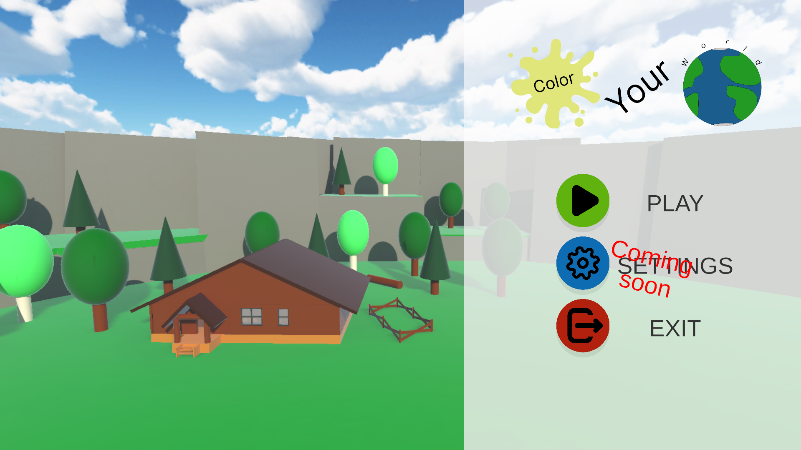
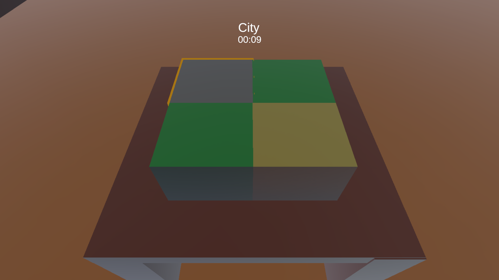
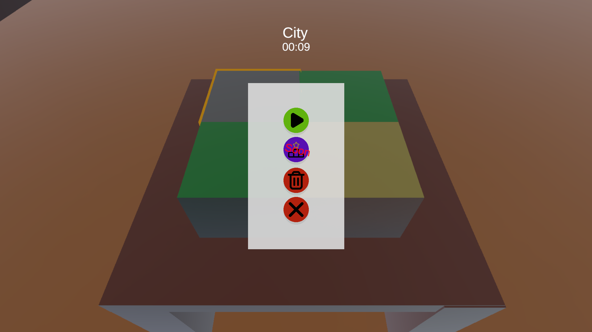
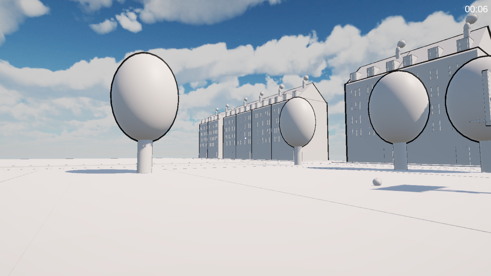
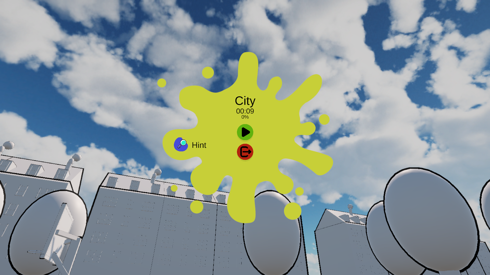

# Color your world

are you bored and enjoy color by numbers? Then Color your world is perfect for you! Jump into an uncolored 3D world and see how beautiful it becomes once everything is colored.

Itch.io: https://nils1024.itch.io/color-your-world

## How to play?
1. Press the start button in the main menu
2. Select a level you want to play (I recommend starting with the City level)
3. Confirm your selection with a left click
4. In the level selection menu:
    - Play symbol -> Start the level
    - Trash bin -> Reset the level
    - Cross -> Close the selection menu
5. Move around using W, A, S, D
    - Jump with space
    - Walk faster with shift
6. Color all uncolored parts by left-clicking on them.
7. Press esc to open the in-game menu, where you can see your progress, return to the main menu or get a hint for a leftover piece.

## Screenshots

## Building
1. Open the project in Unity 6 with Web support installed
2. Change build platform to Web
3. Build the game